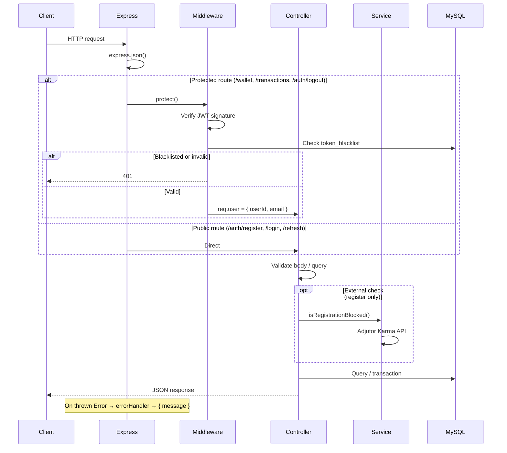
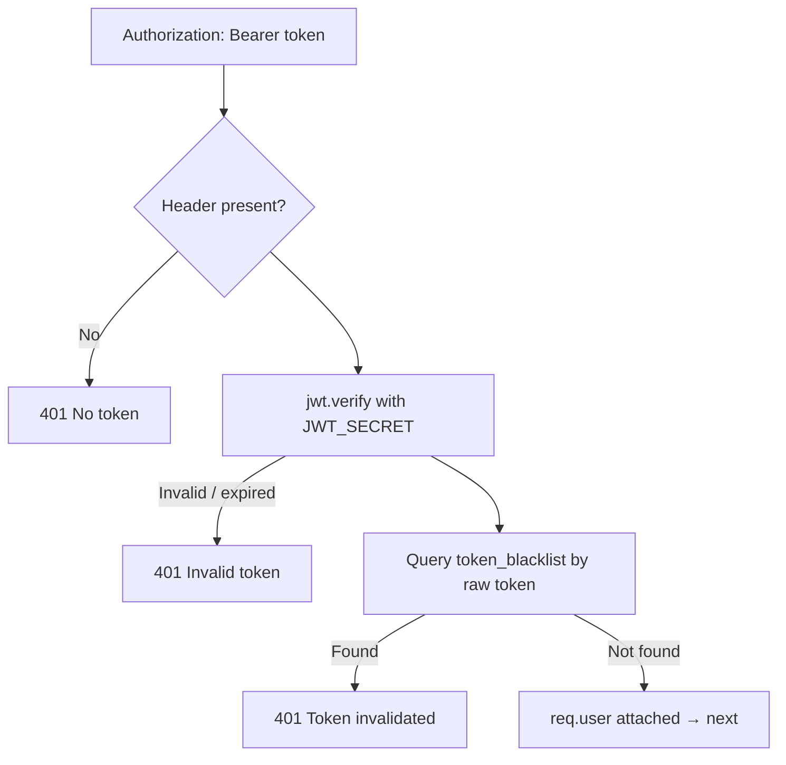
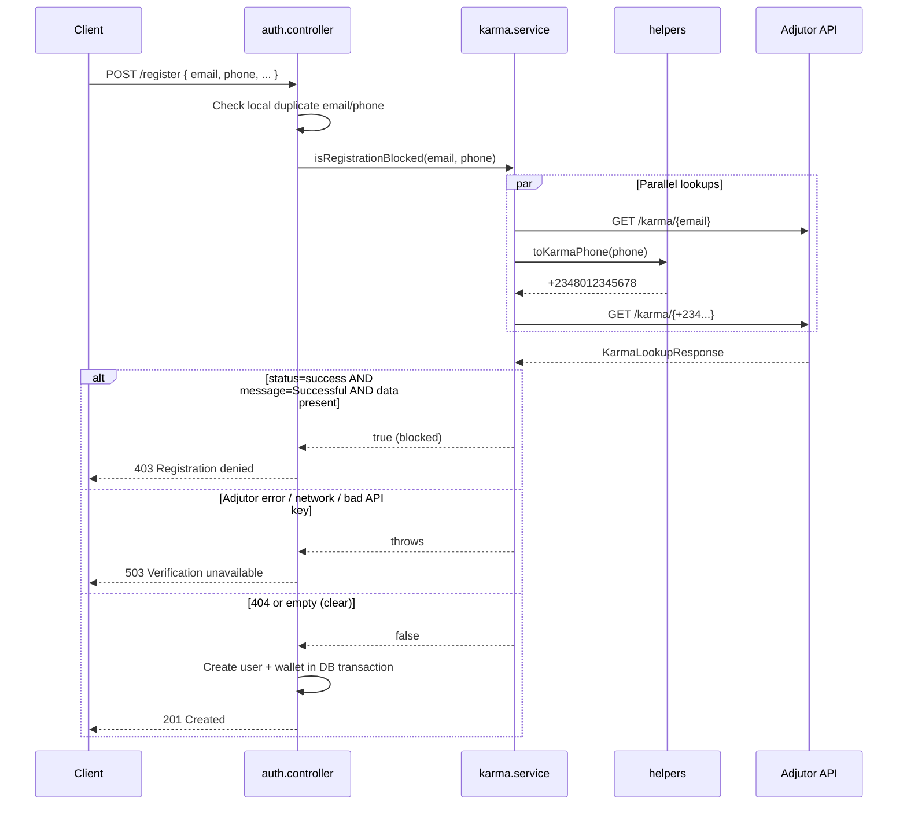
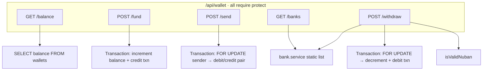

# Demo Credit Wallet API — Architecture

Node.js / Express 5 backend for a lending MVP wallet: user onboarding with identity screening, JWT auth, wallet balance management, peer transfers, bank withdrawals, and transaction history. Persistence is MySQL via Knex.js.

---

## High-Level System View

```mermaid
flowchart TB
    subgraph Client
        APP[Mobile / Web Client]
    end

    subgraph API["Express API (backend/src)"]
        APP -->|HTTP JSON| ROUTES

        subgraph Middleware
            JSON[express.json]
            AUTH_MW[protect middleware]
            ERR[errorHandler]
        end

        ROUTES --> JSON
        JSON --> AUTH_MW

        subgraph Routes
            AUTH_R[/api/auth]
            WALLET_R[/api/wallet]
            TXN_R[/api/transactions]
        end

        AUTH_MW --> WALLET_R
        AUTH_MW --> TXN_R

        subgraph Controllers
            AUTH_C[auth.controller]
            WALLET_C[wallet.controller]
            TXN_C[transaction.controller]
        end

        AUTH_R --> AUTH_C
        WALLET_R --> WALLET_C
        TXN_R --> TXN_C

        subgraph Services
            KARMA[karma.service]
            BANK[bank.service]
        end

        AUTH_C --> KARMA
        WALLET_C --> BANK
    end

    subgraph External
        ADJUTOR[Adjutor Karma API]
    end

    subgraph Data
        MYSQL[(MySQL)]
    end

    KARMA -->|GET /v2/verification/karma/{identity}| ADJUTOR
    AUTH_C --> MYSQL
    WALLET_C --> MYSQL
    TXN_C --> MYSQL
    AUTH_MW --> MYSQL

    ERR --> APP
    AUTH_C --> APP
    WALLET_C --> APP
    TXN_C --> APP
```

---

## Layered Structure

```
backend/src/
├── server.ts              Entry point — boots Express, listens on PORT
├── app.ts                 App wiring — middleware, routes, error handler
├── routes/                URL → controller mapping + auth guards
├── controllers/           Request validation, orchestration, HTTP responses
├── middlewares/           JWT verification, token blacklist, global errors
├── services/              External APIs & domain helpers (Karma, banks)
├── config/db.ts           Knex connection pool
├── db/migrations/         Schema (users, wallets, tokens, transactions)
├── types/                 Shared TypeScript interfaces
└── utils/helpers.ts       IDs, references, token hashing, phone formatting
```

| Layer        | Responsibility |
| ------------ | -------------- |
| **Routes**   | Mount paths; apply `protect` on wallet & transaction routes |
| **Controllers** | Validate input, call services/DB, set status codes |
| **Middlewares** | Cross-cutting auth and error formatting |
| **Services** | Adjutor Karma lookups; static eligible-bank list & NUBAN checks |
| **Database** | Source of truth for users, balances, ledger, tokens |

---

## Request Lifecycle



Every controller uses `express-async-handler`. Controllers set `res.status()` before throwing; `errorHandler` reads that status and returns `{ message }` (plus stack in development).

---

## Authentication

JWT-based auth with **short-lived access tokens** and **rotating refresh tokens**. Passwords are hashed with bcrypt (12 rounds). Refresh tokens are opaque random bytes stored as SHA-256 hashes — never stored in plaintext.

### Token model

| Token | Storage | Lifetime | Payload / format |
| ----- | ------- | -------- | ---------------- |
| Access (JWT) | Client only | `JWT_ACCESS_EXPIRES_IN` (default 15m) | `{ userId, email }` signed with `JWT_SECRET` |
| Refresh | Client + `refresh_tokens` table (hashed) | `JWT_REFRESH_EXPIRES_IN` (default 7d) | 64-char hex from `crypto.randomBytes(32)` |

### Auth flows

```mermaid
flowchart LR
    subgraph Register["POST /api/auth/register"]
        R1[Validate fields] --> R2[Duplicate email/phone?]
        R2 -->|409| R_FAIL[Reject]
        R2 --> R3[Karma check]
        R3 -->|403| R_KARMA[Reject — blacklisted]
        R3 -->|503| R_SVC[Karma unavailable]
        R3 -->|pass| R4[bcrypt hash password]
        R4 --> R5["DB transaction: users + wallets"]
        R5 --> R_OK[201 Created]
    end

    subgraph Login["POST /api/auth/login"]
        L1[Find user by email] --> L2[bcrypt.compare]
        L2 -->|fail| L_FAIL[401]
        L2 --> L3[issueAuthTokens]
        L3 --> L_OK[200 + token + refreshToken]
    end

    subgraph Refresh["POST /api/auth/refresh"]
        RF1[Hash refreshToken] --> RF2[Lookup refresh_tokens]
        RF2 -->|missing / expired| RF_FAIL[401]
        RF2 --> RF3[Delete old refresh row]
        RF3 --> RF4[Issue new access + refresh]
        RF4 --> RF_OK[200]
    end

    subgraph Logout["POST /api/auth/logout · protect"]
        LO1[Decode access token exp] --> LO2[Insert token_blacklist]
        LO2 --> LO3[Delete refresh token(s)]
        LO3 --> LO_OK[200]
    end
```

### Protected-route gate (`protect` middleware)



Logout blacklists the **raw access token** until its natural expiry (`expired_at` from JWT `exp`). Refresh rotation deletes the used refresh hash before issuing a new pair, limiting replay.

---

## Karma Blacklisting (Registration Gate)

Before any user row is written, registration calls **Adjutor Karma** for both email and phone in parallel.



**Phone normalization** (`toKarmaPhone`):

- Strip non-digits
- `080...` → `+23480...`
- Already `234...` → `+234...`

**Environment:** `ADJUTOR_API_KEY` (or fallback `API_KEY`) sent as `Authorization: Bearer ...`.

Karma runs **only at registration** — login and wallet operations do not re-check Adjutor.

---

## Security Checks Summary

| Stage | Check | On failure |
| ----- | ----- | ---------- |
| **Register** | Required fields | 400 |
| **Register** | Duplicate email/phone in DB | 409 |
| **Register** | Adjutor Karma (email + phone) | 403 / 503 |
| **Register** | Password stored as bcrypt hash | — |
| **Login** | User exists + password match | 401 (generic message) |
| **Refresh** | Valid, non-expired refresh hash | 401 |
| **Protected routes** | Bearer JWT + not blacklisted | 401 |
| **Fund / send / withdraw** | Positive numeric amount | 400 |
| **Send** | Cannot send to self | 400 |
| **Send** | Recipient exists by phone | 404 |
| **Send / withdraw** | Sufficient balance (locked row) | 400 |
| **Withdraw** | Valid 10-digit NUBAN | 400 |
| **Withdraw** | Bank in eligible list (UBA, OPay, PalmPay) | 400 |
| **Transactions** | User scoped to own rows only | — (via query filter) |

---

## Wallet Operations

Each user has exactly **one wallet** (1:1 with `users`, created atomically at registration). Balance is `DECIMAL(15,2)` in NGN.



### Fund (`POST /fund`)

Simulated top-up (production would use a payment webhook). Inside one DB transaction:

1. Increment wallet balance
2. Insert **credit** transaction (`sender_id: null`, `receiver_id: user`)

### Send (`POST /send`)

Peer transfer by **recipient phone number**:

1. Validate amount; reject self-transfer
2. Resolve recipient by phone
3. **DB transaction:**
   - `SELECT balance ... FOR UPDATE` on sender wallet
   - Reject if balance &lt; amount
   - Decrement sender, increment recipient
   - Insert **debit** (sender view) and **credit** (receiver view) with shared `reference`

### Withdraw (`POST /withdraw`)

Simulated payout (no external transfer API yet):

1. Validate amount, bank code/slug/name, 10-digit NUBAN
2. Resolve bank via `findEligibleBank`
3. **DB transaction:**
   - `FOR UPDATE` wallet row
   - Balance check → decrement
   - Insert **debit** transaction with withdrawal description

---

## Transactions & Ledger

The `transactions` table is an append-only ledger. Transfers create **two rows** (debit + credit) linked by the same `reference` (`TXN-{uuid}`).

```mermaid
erDiagram
    users ||--o| wallets : "has one"
    users ||--o{ refresh_tokens : "has many"
    users ||--o{ token_blacklist : "has many"
    users ||--o{ transactions : "sender"
    users ||--o{ transactions : "receiver"

    users {
        string id PK
        string email UK
        string phone UK
        string password
    }

    wallets {
        string id PK
        string user_id FK UK
        decimal balance
    }

    transactions {
        string id PK
        string sender_id FK "nullable for top-up"
        string receiver_id FK
        decimal amount
        enum type "credit | debit"
        string reference
        enum status "pending | success | failed"
    }

    refresh_tokens {
        string token_hash UK
        datetime expires_at
    }

    token_blacklist {
        text token
        datetime expired_at
    }
```

### History (`GET /api/transactions`)

Protected. Paginated (`page`, `limit` max 50). Optional `type` filter:

| `type` query | Rows returned |
| ------------ | ------------- |
| `credit` | User is `receiver_id` and type is credit |
| `debit` | User is `sender_id` and type is debit |
| *(omit)* | User is sender **or** receiver |

Joins `users` for sender/receiver name and phone in the response.

---

## Concurrency & Data Integrity

Operations that mutate balance use **Knex transactions** and **`SELECT ... FOR UPDATE`** on the wallet row before debiting:

- **Send money** — locks sender wallet; prevents double-spend under concurrent requests
- **Withdraw** — same pattern on the user's wallet

Registration uses a single transaction to insert `users` + `wallets` so a user is never created without a wallet.

Transfer references tie debit/credit pairs for auditability. Status defaults to `success` (no async settlement yet).

---

## External Dependencies

| Service | Used by | Purpose |
| ------- | ------- | ------- |
| **Adjutor Karma** | `karma.service` | Identity blacklist at registration |
| **MySQL** | All controllers + auth middleware | Persistent storage |
| **Eligible banks** | `bank.service` | Static UBA / OPay / PalmPay list (placeholder for Paystack/Flutterwave) |

Funding and withdrawal do **not** call external payment APIs in the current MVP — balances and payout records are updated locally only.

---

## API Surface (Quick Reference)

| Method | Path | Auth | Domain |
| ------ | ---- | ---- | ------ |
| GET | `/health` | No | Health check |
| POST | `/api/auth/register` | No | Register + Karma + wallet create |
| POST | `/api/auth/login` | No | Issue tokens |
| POST | `/api/auth/refresh` | No | Rotate tokens |
| POST | `/api/auth/logout` | Yes | Blacklist access + revoke refresh |
| GET | `/api/wallet/balance` | Yes | Read balance |
| POST | `/api/wallet/fund` | Yes | Simulated top-up |
| POST | `/api/wallet/send` | Yes | P2P transfer |
| GET | `/api/wallet/banks` | Yes | Eligible withdrawal banks |
| POST | `/api/wallet/withdraw` | Yes | Simulated withdrawal |
| GET | `/api/transactions` | Yes | Paginated history |

---

## Environment Variables (Security-Relevant)

| Variable | Role |
| -------- | ---- |
| `JWT_SECRET` | Signs and verifies access tokens |
| `JWT_ACCESS_EXPIRES_IN` | Access token TTL |
| `JWT_REFRESH_EXPIRES_IN` | Refresh token TTL |
| `ADJUTOR_API_KEY` | Adjutor Karma Bearer token |
| `DB_*` | MySQL connection |

Never commit secrets; configure via `.env` at project root.
