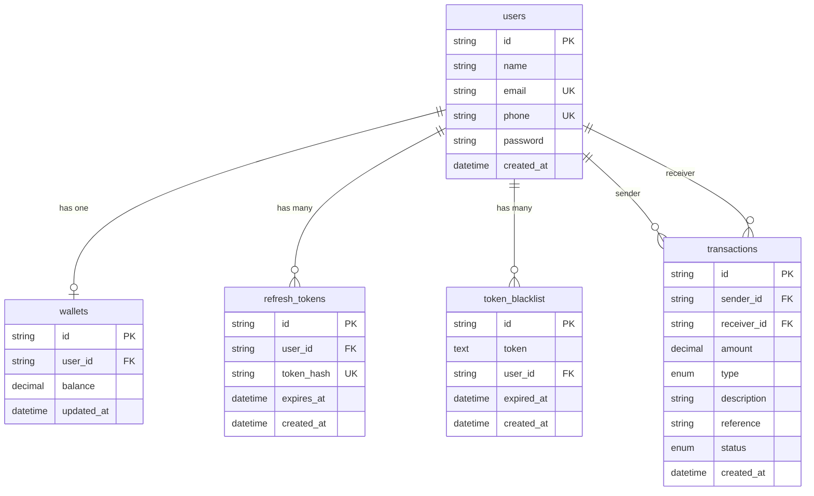

# Demo Credit Wallet API

A Node.js wallet service built for the Demo Credit lending MVP. Users can register, fund their wallet, transfer money to other users, withdraw to supported Nigerian banks, and view transaction history.

## Features

- **User registration & login** — JWT access tokens with refresh-token rotation and logout blacklisting
- **Karma blacklisting** — Registration blocked when email or phone appears on Adjutor Karma
- **Wallet funding** — Direct top-up endpoint (simulated; production would use a payment gateway callback)
- **Peer-to-peer transfers** — Send funds to another user by phone number
- **Withdrawals** — Debit wallet and record payout to eligible banks (UBA, OPay, PalmPay)
- **Transaction history** — Paginated ledger with optional credit/debit filtering
- **Transactional integrity** — Transfers and withdrawals use database transactions with row-level locking (`FOR UPDATE`)

## Tech Stack

| Layer        | Technology        |
| ------------ | ----------------- |
| Runtime      | Node.js (LTS)     |
| Language     | TypeScript        |
| Framework    | Express 5         |
| ORM          | Knex.js           |
| Database     | MySQL             |
| Auth         | JWT + bcrypt      |

## Project Structure

```
backend/
├── src/
│   ├── config/          # Database & Knex configuration
│   ├── controllers/     # Route handlers (auth, wallet, transactions)
│   ├── db/migrations/   # Knex schema migrations
│   ├── middlewares/     # Auth & error handling
│   ├── routes/          # Express route definitions
│   ├── services/        # External/domain services (banks, Karma)
│   ├── types/           # Shared TypeScript interfaces
│   ├── utils/           # Helpers (IDs, references, token hashing)
│   ├── app.ts           # Express app setup
│   └── server.ts        # Entry point
├── scripts/
│   └── reset-database.ts
├── knexfile.ts
└── package.json
```

## Entity Relationship Diagram



## Prerequisites

- Node.js 18+ (LTS recommended)
- MySQL 8+
- pnpm (or npm/yarn)

## Environment Variables

Create a `.env` file in the project root:

```env
PORT=3300
DB_HOST=localhost
DB_USER=your_mysql_user
DB_PASSWORD=your_mysql_password
DB_NAME=demo_credit
JWT_SECRET=your_secret_key
JWT_ACCESS_EXPIRES_IN=15m
JWT_REFRESH_EXPIRES_IN=7d
ADJUTOR_API_KEY=your_adjutor_api_key
```

| Variable                 | Description                          | Default        |
| ------------------------ | ------------------------------------ | -------------- |
| `PORT`                   | HTTP server port                     | `5500`         |
| `DB_HOST`                | MySQL host                           | `localhost`    |
| `DB_PORT`                | MySQL port                           | `3306`         |
| `DB_USER`                | MySQL username                       | `root`         |
| `DB_PASSWORD`            | MySQL password                       | `""`           |
| `DB_NAME`                | MySQL database name                  | `demo_credit`  |
| `JWT_SECRET`             | Secret for signing access tokens     | — (required)   |
| `JWT_ACCESS_EXPIRES_IN`  | Access token lifetime                | `15m`          |
| `JWT_REFRESH_EXPIRES_IN` | Refresh token lifetime               | `7d`           |
| `ADJUTOR_API_KEY`        | Adjutor Bearer token for Karma lookup | — (required)  |

> `ADJUTOR_API_KEY` can also be supplied as `API_KEY` for backward compatibility.

## Karma Blacklisting

Before a new account is created, the registration flow checks the submitted **email** and **phone** against [Adjutor Karma](https://adjutor.lendsqr.com) (`GET /v2/verification/karma/{identity}`). If either identity returns a successful Karma hit, registration is rejected.

**Flow:**

1. User submits registration details.
2. The API checks for duplicate email/phone in the local database.
3. Email and phone are looked up in parallel via Adjutor Karma.
4. Phone numbers are normalized to international format (e.g. `08012345678` → `+2348012345678`) before lookup.
5. If either lookup is a Karma hit → **403** (registration denied).
6. If the Karma service is unavailable or misconfigured → **503** (verification could not be completed).
7. If both lookups pass → account and wallet are created as usual.

A Karma **hit** is when Adjutor responds with `status: "success"`, `message: "Successful"`, and a non-empty `data` payload. A **404** or empty response is treated as clear (not blacklisted).

## Getting Started

### 1. Install dependencies

```bash
pnpm install
```

### 2. Create the database

```sql
CREATE DATABASE demo_credit;
```

### 3. Run migrations

```bash
pnpm migrate
```

### 4. Start the development server

```bash
pnpm dev
```

The API will be available at `http://localhost:3300` (or your configured `PORT`).

### Other scripts

| Command              | Description                          |
| -------------------- | ------------------------------------ |
| `pnpm build`         | Compile TypeScript to `dist/`        |
| `pnpm start`         | Run compiled production build        |
| `pnpm migrate`       | Apply pending migrations             |
| `pnpm migrate:rollback` | Roll back last migration batch    |
| `pnpm migrate:make <name>` | Create a new migration file   |
| `pnpm migrate:reset` | Drop all tables and re-run migrations |

## Authentication

Protected routes require a Bearer token in the `Authorization` header:

```
Authorization: Bearer <access_token>
```

**Flow:**

1. `POST /api/auth/register` — create account after Karma verification (wallet is created automatically)
2. `POST /api/auth/login` — receive `token` (access) and `refreshToken`
3. Use `token` on protected endpoints
4. `POST /api/auth/refresh` — exchange `refreshToken` for new tokens (rotation)
5. `POST /api/auth/logout` — blacklist access token and revoke refresh token(s)

## API Reference

Base URL: `/api`

### Health

| Method | Path      | Auth | Description        |
| ------ | --------- | ---- | ------------------ |
| GET    | `/health` | No   | Service health check |

**Response `200`**

```json
{
  "status": "ok",
  "message": "Demo Credit API is running 🟢"
}
```

---

### Auth

#### Register

`POST /api/auth/register`

```json
{
  "name": "Jane Doe",
  "email": "jane@example.com",
  "phone": "08012345678",
  "password": "securePassword123"
}
```

**Response `201`**

```json
{
  "message": "Account created successfully! Your wallet is ready.",
  "user": {
    "id": "uuid",
    "name": "Jane Doe",
    "email": "jane@example.com",
    "phone": "08012345678"
  }
}
```

**Response `403`** — email or phone flagged on Adjutor Karma:

```json
{
  "message": "Registration denied. This identity is not eligible for onboarding."
}
```

**Response `503`** — Adjutor Karma lookup failed (network, invalid API key, or service error):

```json
{
  "message": "Unable to complete identity verification. Please try again later."
}
```

#### Login

`POST /api/auth/login`

```json
{
  "email": "jane@example.com",
  "password": "securePassword123"
}
```

**Response `200`**

```json
{
  "message": "Login successful.",
  "token": "eyJhbG...",
  "refreshToken": "a1b2c3...",
  "user": {
    "id": "uuid",
    "name": "Jane Doe",
    "email": "jane@example.com",
    "phone": "08012345678"
  }
}
```

#### Refresh token

`POST /api/auth/refresh`

```json
{
  "refreshToken": "a1b2c3..."
}
```

#### Logout

`POST /api/auth/logout` · **Auth required**

Optional body to revoke a specific refresh token:

```json
{
  "refreshToken": "a1b2c3..."
}
```

---

### Wallet

All wallet routes require authentication.

#### Get balance

`GET /api/wallet/balance`

**Response `200`**

```json
{
  "balance": 15000.5,
  "formatted": "₦15,000.50"
}
```

#### Fund wallet

`POST /api/wallet/fund`

```json
{
  "amount": 5000
}
```

**Response `201`**

```json
{
  "message": "Wallet funded successfully with ₦5,000.",
  "reference": "TXN-uuid"
}
```

> In production, funding would be triggered by a payment processor webhook (Paystack, Flutterwave, etc.) rather than a direct API call.

#### Send money

`POST /api/wallet/send`

```json
{
  "recipientPhone": "08087654321",
  "amount": 2000,
  "description": "Loan repayment"
}
```

**Response `201`**

```json
{
  "message": "₦2,000 sent to John Smith successfully.",
  "reference": "TXN-uuid"
}
```

Creates paired debit (sender) and credit (receiver) transaction records under the same reference.

#### List eligible banks

`GET /api/wallet/banks`

**Response `200`**

```json
{
  "banks": [
    { "code": "033", "name": "UBA", "slug": "uba" },
    { "code": "100004", "name": "OPay", "slug": "opay" },
    { "code": "100033", "name": "PalmPay", "slug": "palmpay" }
  ]
}
```

#### Withdraw

`POST /api/wallet/withdraw`

`bankCode` accepts the bank code, slug (e.g. `"opay"`), or name (e.g. `"UBA"`).

```json
{
  "amount": 3000,
  "bankCode": "opay",
  "accountNumber": "1234567890",
  "description": "Optional note"
}
```

**Response `201`**

```json
{
  "message": "₦3,000 withdrawn to OPay successfully.",
  "reference": "TXN-uuid",
  "balance": 12000.5,
  "bank": { "code": "100004", "name": "OPay" },
  "accountNumber": "1234567890"
}
```

Account number must be a valid 10-digit NUBAN.

---

### Transactions

#### Get history

`GET /api/transactions?page=1&limit=10&type=credit` · **Auth required**

| Query   | Description                                      |
| ------- | ------------------------------------------------ |
| `page`  | Page number (default: `1`)                       |
| `limit` | Items per page, max 50 (default: `10`)           |
| `type`  | Optional filter: `credit` or `debit`             |

**Response `200`**

```json
{
  "transactions": [
    {
      "id": "uuid",
      "amount": "5000.00",
      "type": "credit",
      "description": "Wallet top-up",
      "reference": "TXN-uuid",
      "status": "success",
      "created_at": "2026-05-31T10:00:00.000Z",
      "sender_name": null,
      "sender_phone": null,
      "receiver_name": "Jane Doe",
      "receiver_phone": "08012345678"
    }
  ],
  "pagination": {
    "page": 1,
    "limit": 10,
    "total": 1,
    "totalPages": 1
  }
}
```

## Error Responses

Errors return JSON with a `message` field. Status codes follow HTTP conventions:

| Code | Typical cause                              |
| ---- | ------------------------------------------ |
| 400  | Validation error, insufficient balance     |
| 401  | Missing, invalid, or blacklisted token     |
| 403  | Registration denied (Karma blacklisted identity) |
| 404  | User, wallet, or recipient not found       |
| 409  | Email or phone already registered          |
| 503  | Adjutor Karma verification unavailable     |
| 500  | Unexpected server error                    |

Example:

```json
{
  "message": "Insufficient balance. Your balance is ₦500."
}
```

## Design Notes

- **Karma gate at signup** — Registration calls Adjutor Karma for both email and phone before any user row is written; blacklisted identities never reach the database.
- **One wallet per user** — Created atomically during registration inside a DB transaction.
- **Transfer safety** — Sender balance is locked with `SELECT ... FOR UPDATE` before debit to prevent race conditions.
- **Double-entry ledger** — Transfers write both a debit and credit row sharing the same `reference`.
- **Simulated funding & withdrawal** — No external payment provider is wired yet; bank list is static and payouts are recorded locally only.
- **Currency** — Amounts are stored as `DECIMAL(15,2)` and displayed in Nigerian Naira (₦).

## License

ISC
